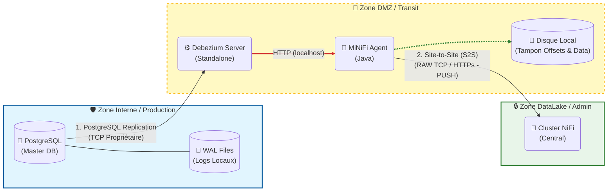

# ingest-archi

### 📚 1. Debezium Server (Le moteur d'extraction)

C'est ici que tu trouveras les détails sur le fonctionnement "Standalone" (sans Kafka Connect) et la gestion des offsets (le fameux "marque-page").

  * **Documentation Officielle Debezium Server :**
    C'est la bible pour configurer le fichier `application.properties`.
    🔗 [Debezium Server Operations Guide](https://debezium.io/documentation/reference/stable/operations/debezium-server.html)
  * **Gestion des Offsets (File vs Redis) :**
    Pour comprendre comment Debezium stocke sa position localement (le point crucial si MiNiFi tombe).
    🔗 [Debezium Server Configuration](https://www.google.com/search?q=https://debezium.io/documentation/reference/stable/operations/debezium-server.html%23_configuration)

### 📡 2. Apache MiNiFi & NiFi (Le transport sécurisé)

Ces liens expliquent pourquoi nous utilisons MiNiFi en "Gateway" et le protocole Site-to-Site pour la sécurité (unidirectionnel).

  * **Apache MiNiFi (Java Agent) :**
    La page du projet qui explique la différence entre NiFi (lourd) et MiNiFi (léger).
    🔗 [Apache NiFi MiNiFi Overview](https://nifi.apache.org/minifi/)
  * **Protocole Site-to-Site (S2S) :**
    L'explication technique de la communication sécurisée entre MiNiFi et NiFi (c'est ce protocole qui permet la rupture protocolaire).
    🔗 [NiFi Site-to-Site Protocol Specification](https://www.google.com/search?q=https://nifi.apache.org/docs/nifi-docs/html/administration-guide.html%23site_to_site_properties)

### 🗄️ 3. PostgreSQL (La source)

Pour comprendre comment Debezium peut lire les logs à distance sans toucher aux fichiers physiques du serveur.

  * **Réplication Logique & WAL :**
    La documentation Postgres qui explique comment le flux de données est généré à partir des fichiers WAL.
    🔗 [PostgreSQL Logical Replication](https://www.postgresql.org/docs/current/logical-replication.html)

-----

### 🖼️ Ton Schéma d'Architecture (DMZ Sécurisée)

Comme demandé, voici le schéma technique complet de la solution validée ensemble. Tu peux utiliser ce code pour générer le graphique, ou faire une capture d'écran.

Ce schéma met en évidence la **DMZ** et la **Rupture de Protocole**.

**Comment récupérer ce schéma ?**

1.  **Capture d'écran :** Tu peux simplement "snipper" l'image ci-dessus.
2.  **Draw.io :** Si tu veux le modifier, va sur [draw.io](https://app.diagrams.net/), clique sur `Arrange` \> `Insert` \> `Advanced` \> `Mermaid` et colle le code ci-dessus. Il générera le diagramme éditable.

[Apache NiFi Site to Site Explained](https://www.youtube.com/watch?v=CsrpPD8NKVU)
Cette vidéo est particulièrement pertinente car elle illustre visuellement le concept du protocole "Site-to-Site" que nous allons utiliser pour sécuriser la liaison entre ta DMZ et ton cluster central.

http://googleusercontent.com/youtube_content/0
