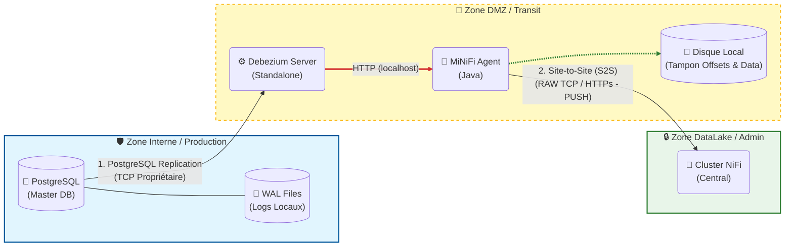

# ingest-archi


### 📚 1. Debezium Server (Le moteur d'extraction)

C'est ici que tu trouveras les détails sur le fonctionnement "Standalone" (sans Kafka Connect) et la gestion des offsets (le fameux "marque-page").

  * **Documentation Officielle Debezium Server :**
    C'est la bible pour configurer le fichier `application.properties`.
    🔗 [Debezium Server Operations Guide](https://debezium.io/documentation/reference/stable/operations/debezium-server.html)
  * **Gestion des Offsets (File vs Redis) :**
    Pour comprendre comment Debezium stocke sa position localement (le point crucial si MiNiFi tombe).
    🔗 [Debezium Server Configuration](https://www.google.com/search?q=https://debezium.io/documentation/reference/stable/operations/debezium-server.html%23_configuration)

### 📡 2. Apache MiNiFi & NiFi (Le transport sécurisé)

Ces liens expliquent pourquoi nous utilisons MiNiFi en "Gateway" et le protocole Site-to-Site pour la sécurité (unidirectionnel).

  * **Apache MiNiFi (Java Agent) :**
    La page du projet qui explique la différence entre NiFi (lourd) et MiNiFi (léger).
    🔗 [Apache NiFi MiNiFi Overview](https://nifi.apache.org/minifi/)
  * **Protocole Site-to-Site (S2S) :**
    L'explication technique de la communication sécurisée entre MiNiFi et NiFi (c'est ce protocole qui permet la rupture protocolaire).
    🔗 [NiFi Site-to-Site Protocol Specification](https://www.google.com/search?q=https://nifi.apache.org/docs/nifi-docs/html/administration-guide.html%23site_to_site_properties)

### 🗄️ 3. PostgreSQL (La source)

Pour comprendre comment Debezium peut lire les logs à distance sans toucher aux fichiers physiques du serveur.

  * **Réplication Logique & WAL :**
    La documentation Postgres qui explique comment le flux de données est généré à partir des fichiers WAL.
    🔗 [PostgreSQL Logical Replication](https://www.postgresql.org/docs/current/logical-replication.html)

-----

### 🖼️ Ton Schéma d'Architecture (DMZ Sécurisée)

Comme demandé, voici le schéma technique complet de la solution validée ensemble. Tu peux utiliser ce code pour générer le graphique, ou faire une capture d'écran.

Ce schéma met en évidence la **DMZ** et la **Rupture de Protocole**.



**Comment récupérer ce schéma ?**

1.  **Capture d'écran :** Tu peux simplement "snipper" l'image ci-dessus.
2.  **Draw.io :** Si tu veux le modifier, va sur [draw.io](https://app.diagrams.net/), clique sur `Arrange` \> `Insert` \> `Advanced` \> `Mermaid` et colle le code ci-dessus. Il générera le diagramme éditable.

[Apache NiFi Site to Site Explained](https://www.youtube.com/watch?v=CsrpPD8NKVU)
Cette vidéo est particulièrement pertinente car elle illustre visuellement le concept du protocole "Site-to-Site" que nous allons utiliser pour sécuriser la liaison entre ta DMZ et ton cluster central.

http://googleusercontent.com/youtube_content/0


C'est une excellente question d'optimisation ("scaling"). Tu veux éviter d'avoir 50 VMs si tu as 50 bases à surveiller.

La réponse courte est : **Oui pour le serveur (la machine), mais avec une subtilité importante pour le logiciel Debezium.**

Voici comment il faut l'envisager techniquement, car Debezium Server et MiNiFi ne fonctionnent pas exactement pareil sur ce point.

### 1\. La contrainte de Debezium Server : "Un seul chef"

C'est le point clé à retenir : **Une instance (un processus) de Debezium Server ne peut écouter qu'une seule base de données à la fois.**

Contrairement à "Kafka Connect" (qui est un cluster lourd capable de gérer 100 connecteurs), **Debezium Server** est conçu pour être minimaliste :

  * 1 Processus Java = 1 Fichier `application.properties` = 1 Connexion BDD.

**Si tu veux surveiller 10 bases de données sur la même machine, tu dois lancer 10 processus Debezium Server.**

### 2\. La force de MiNiFi : "Le collecteur universel"

À l'inverse, **un seul agent MiNiFi** peut tout à fait recevoir les données de 10, 20 ou 50 Debezium Servers en même temps. Il est "multi-threadé" et conçu pour ingérer massivement.

### L'Architecture "Generic Hub"

Pour réaliser ton idée de "Serveur Générique" en DMZ qui gère X bases de données, la meilleure approche est la **Conteneurisation (Docker)**.

Sur ta VM unique en DMZ, tu vas déployer cette stack :

1.  **MiNiFi (1 seule instance)** : Il écoute sur le port 8080.
2.  **Debezium Container A** : Configuré pour la BDD "Compta". Envoie à `localhost:8080/compta`.
3.  **Debezium Container B** : Configuré pour la BDD "RH". Envoie à `localhost:8080/rh`.
4.  **Debezium Container X**...

### À quoi ça ressemble techniquement (Docker Compose) ?

C'est là que c'est puissant. Tu peux gérer ça avec un seul fichier `docker-compose.yml`.

```yaml
version: '3'
services:

  # --- Le Collecteur Unique ---
  minifi:
    image: apache/nifi-minifi:latest
    ports:
      - "8080:8080" # Écoute les Debeziums
    volumes:
      - ./minifi/config:/opt/minifi/minifi-current/conf

  # --- Surveillance BDD 1 ---
  debezium-compta:
    image: debezium/server:latest
    environment:
      - DEBEZIUM_SOURCE_CONNECTOR_CLASS=io.debezium.connector.postgresql.PostgresConnector
      - DEBEZIUM_SOURCE_DATABASE_HOSTNAME=192.168.1.10 # IP BDD Compta
      - DEBEZIUM_SINK_HTTP_URL=http://minifi:8080/contentListener?source=compta
    volumes:
      - ./data/offsets/compta:/debezium/data # Important : Offset séparé !

  # --- Surveillance BDD 2 ---
  debezium-rh:
    image: debezium/server:latest
    environment:
      - DEBEZIUM_SOURCE_CONNECTOR_CLASS=io.debezium.connector.postgresql.PostgresConnector
      - DEBEZIUM_SOURCE_DATABASE_HOSTNAME=192.168.1.20 # IP BDD RH
      - DEBEZIUM_SINK_HTTP_URL=http://minifi:8080/contentListener?source=rh
    volumes:
      - ./data/offsets/rh:/debezium/data # Important : Offset séparé !
```

### Les points d'attention pour cette approche

Si tu pars sur ce serveur "générique" :

1.  **Isolation des Offsets (CRITIQUE) :**
    Comme montré dans l'exemple ci-dessus, chaque conteneur Debezium doit avoir son **propre dossier** pour stocker son fichier `offsets.dat`. Si Debezium "RH" écrase le fichier de Debezium "Compta", tu vas corrompre tes données.

2.  **Ressources (RAM) :**
    Même si Debezium est léger, chaque instance prend un peu de RAM (disons 256Mo).

      * Si tu as 4 bases : 1 Go de RAM pour les Debeziums + MiNiFi. C'est facile.
      * Si tu as 50 bases : Ça commence à faire une grosse VM (12-16 Go de RAM).

3.  **Routage dans MiNiFi :**
    Dans ta configuration MiNiFi, tu devras être malin. Debezium envoie tout au même endroit.

      * Astuce : Utilise un paramètre d'URL (comme dans mon exemple : `?source=rh`) ou un header HTTP.
      * MiNiFi pourra alors lire cet attribut pour savoir : "Ah, ça c'est des données RH, je les tague comme telles avant de les envoyer au NiFi central".

**En résumé :** Oui, c'est faisable et c'est même la méthode standard (via Docker) pour mutualiser les ressources. Une seule VM peut gérer plusieurs flux, tant que tu lances un conteneur Debezium par source.


